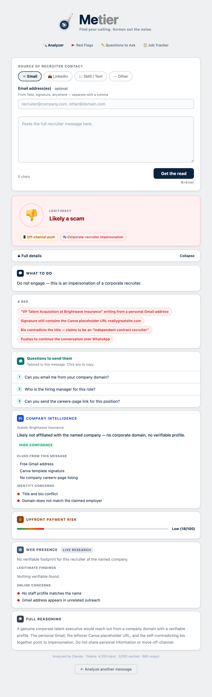
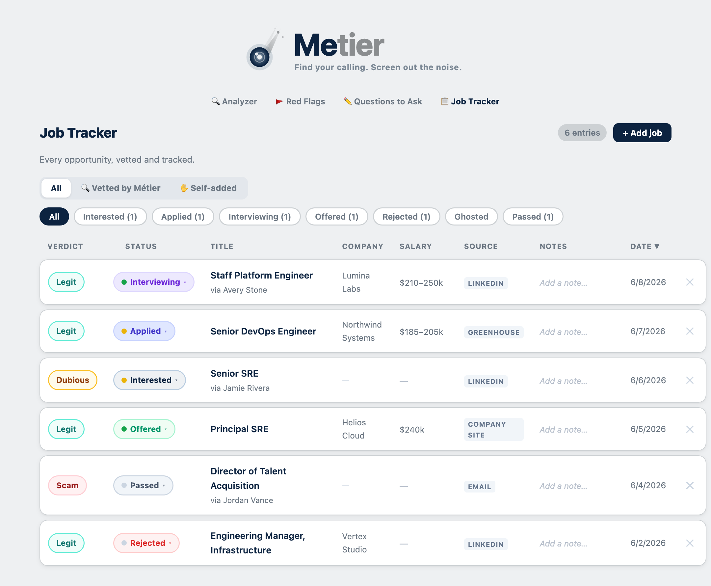
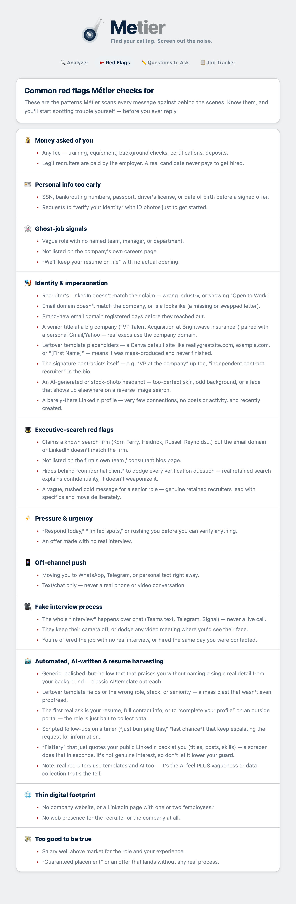
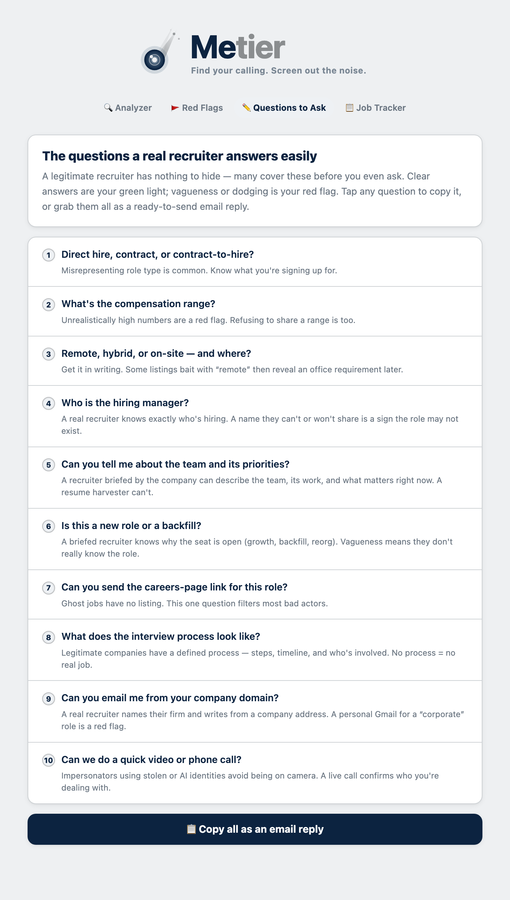

<p align="center">
  
</p>

# Metier

**Find your calling. Screen out the noise.** Metier is the recruiter legitimacy check for career professionals. Paste any recruiter email, LinkedIn DM, or outreach message and get a clear read on whether it's worth your time — plus a tracker for every job you're pursuing.

*Pronounced "met-yay" — from* métier*, your calling, your craft, your vocation.*

> ⚡ **Runs free, no API key required.** Metier ships with a deterministic rules engine and an updatable scam-technique database that vet every message locally — no AI bill, fully self-hostable (even on a Raspberry Pi). Add your own API key to *layer on* an AI-written deep read; without one, the rules engine is the verdict.

- 🎯 **Clear verdict** — Legit, Dubious, or Scam — with the reasoning behind it
- ⚙️ **Deterministic technical forensics** — domain age, DNS/MX/SPF/DMARC, link & URL checks, lookalike domains, disposable inboxes, ATS-slug and email-header (spoof) analysis
- 🧠 **Updatable scam-technique database** — fee/PII/urgency/off-channel/ghost-job patterns in a simple JSON file; add a new technique, no redeploy
- 🔍 **Identity & impersonation checks** — corporate-domain mismatch, free-inbox executives, template/placeholder fakes
- 🔗 **Known-contact correlation** — flags (and hard-floors) senders you previously marked as scams
- 🌐 **Optional AI layer + live web research** — when an API key is present (Claude / OpenAI / Grok)
- 📋 **Job tracker** — every vetted contact and self-found role in one pipeline, with status tracking

---

## See it in action

> *Screenshots use sample data.*

### 🔍 The Analyzer — paste a message, get a verdict

Paste a recruiter email or DM and Métier returns a clear verdict (Legit / Dubious / Scam) with the red flags it found, what to do, tailored questions to send back, company intelligence, and live web-research findings.

<p align="center"></p>

### 📋 Job Tracker — your whole pipeline in one place

Every vetted contact and self-found role, with a legitimacy verdict, status, comp, and source at a glance.

<p align="center"></p>

### 🚩 Common Red Flags &nbsp;·&nbsp; ✏️ Questions to Ask

Know the patterns Métier checks for, and the questions any real recruiter answers in seconds.

<p align="center">
  
  &nbsp;&nbsp;
  
</p>

---

## Quick start

```bash
git clone https://github.com/your-username/metier.git
cd metier
pip install -r requirements.txt
python app.py
```

That's it — open **[http://localhost:5000](http://localhost:5000)** and start vetting. **No API key needed**; the rules engine runs immediately and for free.

### Optional: add an AI layer

Want the AI-written deep read and live web research on top of the rules engine? Add a key:

```bash
cp .env.example .env
# Open .env and add your key (any one provider)
```

When a key is present, the LLM layers on top of the deterministic baseline. When it isn't — or if the call fails — the rules engine is the verdict. You never *need* to pay for inference.

---

## How the verdict works

Every analysis runs the **deterministic layer** first (no API, no cost):

1. **Technical forensics** — domain age (RDAP), DNS/MX/SPF/DMARC, link & URL intelligence, lookalike-domain detection, disposable-inbox checks, ATS-slug verification, and raw email-header (spoof) analysis.
2. **Scam-technique matching** — the message is scored against the pattern database (see below).
3. **Known-contact correlation** — a strong match to a sender you previously flagged as a scam hard-floors the verdict to Scam.

These produce a 0–100 score → **Legit / Dubious / Scam** with the matched evidence as red flags. If an API key is configured, the LLM then *enriches* that baseline (it's told the rule score and may add nuance, but can't quietly score it safer without reason).

## Updating the scam-technique database

New scam trends are just data. Edit **[`scam_patterns.json`](scam_patterns.json)** — each entry is one technique:

```json
{
  "category": "fee", "match_type": "keyword", "pattern": "onboarding fee",
  "weight": 42, "severity": "critical", "polarity": "risk",
  "title": "Upfront fee requested",
  "explanation": "Legitimate recruiters are paid by the employer; a candidate never pays."
}
```

`match_type` is `keyword` or `regex`; `polarity` is `risk` (raises the score) or `trust` (lowers it). Add an entry and restart — the file is synced into the database on startup, and live rows you add directly to the DB are preserved.

---

## Choosing a model provider (optional AI layer)

If you add a key, Métier uses **Claude by default**, but supports **OpenAI** and **Grok (xAI)** too. Pick one in `.env`:

```bash
# Claude (default)
LLM_PROVIDER=anthropic
ANTHROPIC_API_KEY=...

# OpenAI
LLM_PROVIDER=openai
OPENAI_API_KEY=...

# Grok / xAI
LLM_PROVIDER=grok
XAI_API_KEY=...
```

Only the key for your chosen provider is required. OpenAI and Grok need the `openai` package (already in `requirements.txt`). The prompts are tuned for Claude, so other models may score a little differently. The footer under each result shows which provider produced the read.

Open **[http://localhost:5000](http://localhost:5000)**

---

## Running as a service (Linux / systemd)

To keep Metier running in the background on any systemd-based Linux host, a unit
file is included. Edit the paths in `metier.service` to match where you cloned it,
then:

```bash
sudo cp metier.service /etc/systemd/system/
sudo systemctl daemon-reload
sudo systemctl enable metier
sudo systemctl start metier
```

You can also deploy it anywhere that runs Python — a VPS, a home server, or a
platform like Railway, Render, or Fly.io.

---

## Project structure

```
metier/
├── app.py                  # Flask server, rules engine, technical checks + optional LLM
├── scam_patterns.json      # Updatable scam-technique database (synced into SQLite on startup)
├── templates/
│   ├── index.html          # Analyzer
│   ├── history.html        # Job Tracker
│   ├── questions.html      # Questions to Ask
│   └── redflags.html       # Common Red Flags
├── assets/                 # Logos & app icons (SVG)
│   ├── metier-logo.svg
│   ├── metier-logo-dark.svg
│   ├── metier-app-icon.svg
│   └── metier-icon-small.svg
├── data/                   # SQLite database (git-ignored)
├── requirements.txt
├── .env.example
└── metier.service          # systemd unit (optional, for Linux hosts)
```

---

## License

MIT
